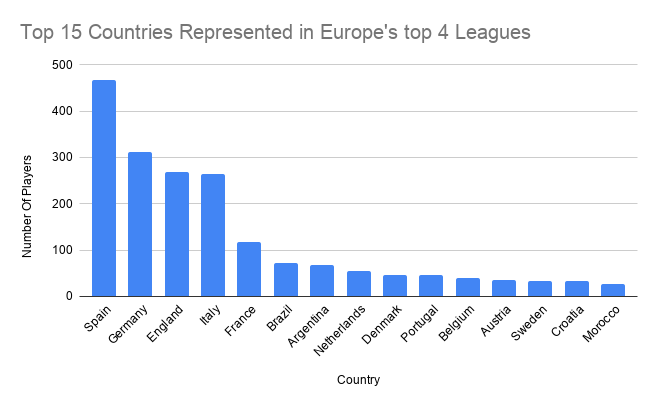

# Nationality Distribution in Europe's Top 4 Football Leagues

## Project Goal
This project analyses the nationality distribution of players across Europe's four major football leagues:

- Premier League
- La Liga
- Serie A
- Bundesliga

The goal was to identify which countries contribute the largest share of players across the leagues.

---

## Data Collection

Player data was collected from official league websites.  
The Magical browser extension was used to export structured player information into Google Sheets.

---

## Data Cleaning

Several inconsistencies were corrected:

- Standardised country names (e.g. Ivory Coast → Côte d’Ivoire)
- Ensured consistent naming conventions
- Verified player nationality entries

---

## Analysis

Player counts were aggregated by country and continent.  
Each country's percentage share of the total player pool was then calculated.

---

## Key Findings

- Spain represents **18.6% of players** across the four leagues, the highest share of any country.
- Germany, England and Italy are the next most represented nations.
- South America is the most represented non-European region.
- Brazil is the most represented non-European country.

---

## Visualisation

